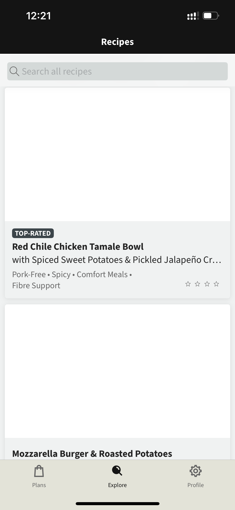

**Summary**

Images are not displayed in the app when the device is on a 3G network. Placeholders remain visible indefinitely, and images do not load even after extended waiting or screen refresh.

**Priority**
High

**Environment**
Staging app, v_0.6.7

**Preconditions**
User is logged in. Device network is set or throttled to 3G connection.

**User details**

- User Email: mobiletest1@gmail.com
- User UID: A82kLmP09sDfTgH45JkLzXcVb91
- OS: Android
- OS Version: 13
- Model: Samsung Galaxy S21

**Steps to reproduce**

1. Launch the app and navigate to the Explore feed page. Verify that images in article sections are displayed.
2. Pull to refresh the screen. Verify that images in article sections are displayed.

**Expected results**

1. Images in article sections are displayed.
2. Images in article sections are displayed.

**Actual results**

1. Images do not load and placeholders (skeleton loader) remain visible.
2. After refreshing images remain missing. No retry mechanism is triggered after initial failure.

**Comments**
This issue was consistently reproduced on multiple devices and accounts under 3G network conditions. The behavior suggests a lack of proper timeout handling or retry logic for image requests on slow connections. Potential impact includes degraded user experience and incomplete content visibility in low-bandwidth environments.

